<!-- Copyright (c) 2026 Roberto D'Angelo. Convergio Community License. -->
# Convergio Platform

AI orchestration platform — Rust daemon (650+ modules), local LLM kernel (Qwen 7B), MCP server, mesh P2P, 89 agents, Telegram bot, Siri integration.

**Free and source-available** under the [Convergio Community License](./LICENSE). Use it, learn from it, build with it. If it helps you, consider supporting [FightTheStroke Foundation](https://fightthestroke.org) — a non-profit for children affected by pediatric stroke.

> Not affiliated with or endorsed by Microsoft Corporation.

Website: [convergio.io](https://convergio.io)

---

## What is Convergio

Convergio Platform is a self-improving AI orchestration system. You describe a goal; Ali (Chief of Staff, Opus) assembles a team of specialized agents, coordinates them across models and machines, validates output through domain-specific validators, and delivers structured results with cost, duration, and learnings.

```bash
convergio solve "Build a SaaS MVP for fitness tracking"
```

Ali handles everything: domain analysis, talent selection (89 agents, 119 skills), plan creation, agent dispatch, real-time monitoring, validation, and knowledge capture.

---

## Quick Start

```bash
git clone https://github.com/Roberdan/ConvergioPlatform.git
cd ConvergioPlatform
./setup.sh                         # env vars, CLI aliases, enable overlay
cd daemon && cargo build --release # build Rust daemon
convergio daemon install           # auto-start on boot
convergio solve "your goal"        # Ali assembles a team and solves
```

The `cvg` CLI (short alias) provides direct access to all daemon operations:

```bash
cvg plan list                              # list active plans
cvg task update 8792 done "Summary"        # mark task done
cvg wave merge 685 2075                    # merge wave to main
cvg checkpoint save 685                    # save plan state
cvg kb search "error keywords"             # search knowledge base
cvg agent list                             # list active agents
cvg kernel status                          # local LLM health
cvg mesh status                            # peer topology
cvg workspace list                         # list active workspaces
```

Common options:

```bash
convergio solve "problem" --autonomous      # no approval gates
convergio solve "problem" --approve-each    # approve every step
convergio solve "problem" --context doc.pdf # attach document context
convergio pause [run_id]                    # suspend, preserve state
convergio resume [run_id]                   # resume paused run
convergio stop [run_id]                     # abort execution
```

---

## Architecture

```mermaid
graph TB
    %% ── User Interfaces ──────────────────────────
    subgraph UI["User Interfaces"]
        DASH["Dashboard Web<br><small>Vanilla JS + Maranello DS</small>"]
        TUI["TUI<br><small>ratatui terminal</small>"]
        CLI["CLI (cvg)<br><small>50+ subcommands</small>"]
        SIRI["Siri / Voice<br><small>Swift CommandCenter</small>"]
        MCP["MCP Server<br><small>17 tools, ring security</small>"]
    end

    %% ── Daemon Core ──────────────────────────────
    subgraph DAEMON["Daemon Core — Rust — :8420"]
        SERVER["HTTP Server (axum)<br><small>26 API modules<br>REST + SSE + WebSocket</small>"]
        ORCH["Orchestrator<br><small>reactor → executor<br>delegation, reaper</small>"]
        IPC["IPC Engine<br><small>budget, locks, worktrees<br>agent coordination</small>"]
        KERN["Kernel / Jarvis<br><small>engine, monitor, recover<br>STT (Whisper) → TTS</small>"]
        SEC["Security<br><small>ACL, audit chain<br>egress, kill switch</small>"]
        RES["Resilience<br><small>circuit breaker, watchdog<br>checkpoint, retry</small>"]
        INF["Inference Router<br><small>classifier → tier routing<br>local > cloud preference</small>"]
        THOR["Thor Validator<br><small>10-gate checklist<br>submitted → done</small>"]
        MEM["Memory<br><small>vector store, embeddings<br>blob store, attestation</small>"]
        VOICE["Voice Pipeline<br><small>VAD → wake word → Whisper<br>intent → pipeline</small>"]
        WS["Workspace<br><small>git connector, merge ops<br>quality gate, release agent</small>"]
        CHAN["Channels<br><small>Slack, Telegram, Email</small>"]
    end

    %% ── Data Layer ───────────────────────────────
    subgraph DATA["Data Layer"]
        DB[("dashboard.db<br><small>SQLite WAL + CRDT</small>")]
        GIT["Git Repos<br><small>GitHub API + subprocess</small>"]
        VEC[("Vector Store<br><small>embeddings + blob</small>")]
    end

    %% ── Mesh Network ─────────────────────────────
    subgraph MESH["Mesh Network — Tailscale P2P"]
        COORD["Mesh Coordinator<br><small>peers, topology, sync<br>HMAC-SHA256 + AES-GCM</small>"]
        PEER1["Peer Node :8420"]
        PEER2["Peer Node :8420"]
    end

    %% ── Evolution Engine ─────────────────────────
    subgraph EVO["Evolution Engine — TypeScript"]
        ECORE["Core<br><small>evaluators, cadence<br>guardrails, experiments</small>"]
        EADAPT["Adapters<br><small>claude, dashboard<br>maranello, telemetry</small>"]
    end

    %% ── LLM Infrastructure ──────────────────────
    subgraph LLM["LLM Infrastructure"]
        LOCAL["Local LLM<br><small>oMLX :8321 + LiteLLM :4000<br>Qwen 7B (Jarvis)</small>"]
        CLOUD["Cloud LLMs<br><small>Opus 4.6 · Sonnet 4.6<br>GPT-5.3 Codex · Gemini 3 Pro</small>"]
    end

    %% ── External Services ────────────────────────
    TG["Telegram Bot API"]
    OCLAW["OpenClaw Bridge<br><small>30+ platforms</small>"]

    %% ── Governance ───────────────────────────────
    subgraph GOV["Agent Governance — Hook-Enforced"]
        HOOKS["10 Enforcement Hooks<br><small>SecretScan, SqliteBlock<br>EvidenceGate, TestGate, ...</small>"]
        CMDS["Commands<br><small>/solve → /planner → /execute</small>"]
        AGENTS["89 Agents · 119 Skills<br><small>12 domains · 27 validation gates</small>"]
    end

    %% ── CONNECTIONS ──────────────────────────────

    %% UI → Daemon
    DASH -- "HTTP + WS<br>/api/* + /ws/dashboard" --> SERVER
    TUI -- "WS /ws/brain" --> SERVER
    CLI -- "HTTP localhost:8420" --> SERVER
    CLI -. "Unix socket<br>~/.claude/ipc.sock" .-> IPC
    SIRI -- "HTTP /api/voice" --> KERN
    MCP -. "stdio → HTTP" .-> SERVER

    %% Internal daemon
    SERVER --> ORCH
    SERVER --> IPC
    SERVER --> KERN
    ORCH --> THOR
    KERN --> INF
    VOICE --> KERN
    WS --> GIT
    CHAN --> SERVER

    %% Daemon → Data
    SERVER --> DB
    IPC --> DB
    MEM --> VEC
    WS -- "api.github.com" --> GIT

    %% Daemon → Mesh
    SERVER -. "Tailscale + HMAC" .-> COORD
    COORD -- "/api/sync/*" --> PEER1
    PEER1 -- "CRDT" --> COORD
    COORD -- "/api/sync/*" --> PEER2
    PEER2 -- "CRDT" --> COORD

    %% Daemon → External
    KERN -- "Bot API" --> TG
    INF -- ":8321" --> LOCAL
    INF -- "HTTPS" --> CLOUD
    SERVER --> OCLAW

    %% Evolution → Daemon
    EADAPT -- "HTTP adapters → /api/*" --> SERVER
    ECORE --> EADAPT

    %% Governance (cross-cutting)
    GOV -. "enforcement" .-> DAEMON

    %% Styling
    classDef ui fill:#1a2744,stroke:#4d9cf6,color:#d4dae4
    classDef daemon fill:#142218,stroke:#42d392,color:#d4dae4
    classDef data fill:#18232e,stroke:#38c8d8,color:#d4dae4
    classDef mesh fill:#18232e,stroke:#38c8d8,color:#d4dae4
    classDef evo fill:#221828,stroke:#e87ab0,color:#d4dae4
    classDef llm fill:#221822,stroke:#b07ee8,color:#d4dae4
    classDef gov fill:#221818,stroke:#e85454,color:#d4dae4
    classDef ext fill:#1a1a22,stroke:#6b7a8d,color:#d4dae4

    class DASH,TUI,CLI,SIRI,MCP ui
    class SERVER,ORCH,IPC,KERN,SEC,RES,INF,THOR,MEM,VOICE,WS,CHAN daemon
    class DB,GIT,VEC data
    class COORD,PEER1,PEER2 mesh
    class ECORE,EADAPT evo
    class LOCAL,CLOUD llm
    class HOOKS,CMDS,AGENTS gov
    class TG,OCLAW ext
```



> Full interactive diagram: [`convergio-architecture.html`](./convergio-architecture.html)

### Execution Flow (hook-enforced)

```
/solve (Opus) → /planner (Opus 1M) → Review (Sonnet) → DB → /execute (Codex) → Thor (Opus, 10 gates) → Merge → Done
```

### Layer Summary

| Layer | Path | Lang | Purpose |
|---|---|---|---|
| **Daemon** | `daemon/` | Rust | HTTP/WS/SSE API (:8420), mesh P2P, IPC, SQLite WAL + CRDT, TUI, `cvg` CLI |
| **Kernel** | `daemon/src/kernel/` | Rust | Local LLM (Qwen 7B), health monitor, verify gate, TTS, Telegram bot |
| **MCP Server** | `daemon/src/mcp_server/` | Rust | Expose daemon as MCP tools for any LLM client (17 tools, ring-based security) |
| **Workspace** | `daemon/src/workspace/` | Rust | Agent isolation, git abstraction, Release Agent, quality gates, event log |
| **Evolution** | `evolution/` | TS | Self-improvement: telemetry → proposals → experiments |
| **Scripts** | `scripts/` | Bash | Mesh ops, platform tooling, document ingestion |
| **Config** | `claude-config/` | MD | 89 agents, 119 skills, 8 rules, 27 validation gates |

Daemon stack: axum · rusqlite WAL · tokio · ssh2 · ratatui · serde · hmac+sha2+aes-gcm · reqwest · tracing

### Model Routing (8 models, 3 providers)

| Alias | Model ID | Tier | Provider | Used for |
|-------|----------|------|----------|----------|
| `opus` | claude-opus-4.6 | Premium | Anthropic | Architecture, triage, validation (Thor) |
| `opus-1m` | claude-opus-4.6-1m | Premium (1M ctx) | Anthropic | Planning (full codebase context) |
| `sonnet` | claude-sonnet-4.6 | Standard | Anthropic | Coordinator, plan review |
| `haiku` | claude-haiku-4.5 | Fast/Cheap | Anthropic | Exploration, documentation |
| `codex` | gpt-5.3-codex | Standard | OpenAI | Task execution, bulk code gen |
| `codex-mini` | gpt-5.1-codex-mini | Fast/Cheap | OpenAI | Config, mechanical edits |
| `gpt-5.4` | gpt-5.4 | Deep reasoning | OpenAI | Deep debugging, design tradeoffs |
| `gemini-3-pro` | gemini-3-pro-preview | Standard (1M ctx) | Google | Large-context research |

Inference Router: classifier → tier routing, local > cloud preference, fallback chain, parallelization control.

### Key Capabilities

| Capability | Detail |
|---|---|
| **250+ API endpoints** | Plans(14), agents(9), mesh(12), kernel(8), node(1), metrics(5), chat(7), nightly(6), workspace(8), memory(4), voice(5) |
| **Voice Engine** | Audio capture (cpal) → VAD (webrtc) → Wake word → STT (Whisper, Metal) → TTS (Voxtral 4B) → Intent classifier |
| **Telegram Bot** | Bidirectional text + voice, long polling, quiet hours (23:00-07:00 CET), daily/weekly reports |
| **Ali Escalation** | "ali dimmi..." → Claude CLI (Opus) subprocess with full system context, fallback to Qwen local |
| **Evolution Engine** | Observe → Measure → Propose → Experiment → Validate → Learn. A/B testing, multi-armed bandit, cost calibration |
| **OpenClaw Bridge** | 30+ messaging platforms (WhatsApp, Slack, Discord, etc.) via webhook + polling |
| **Document Ingestion** | PDF → MD, DOCX → MD, XLSX → CSV, URL, images, folder recursive |
| **MCP Server** | 17 tools (plans, agents, mesh, metrics, kernel, actions, control), ring-based security (0-3) |
| **Nightly Jobs** | Model calibration (Sunday 03:00), guardian checks (daily), auto-rebuild on git pull |

---

## Ecosystem

ConvergioPlatform is the core of a multi-repo ecosystem:

| Repository | Purpose | Status |
|---|---|---|
| [**convergio-web**](https://github.com/Roberdan/convergio-web) | Web + desktop UI (Next.js 15 + Tauri 2.0) | Active |
| [**convergio-design**](https://github.com/Roberdan/convergio-design) | Maranello Luce Design System — 5 themes, 36 components, WCAG 2.2 AA | Active |
| [**convergio**](https://github.com/Roberdan/convergio) | Specs, ADRs, OpenAPI, governance, CI workflows | Active |
| [**convergio-community**](https://github.com/Roberdan/convergio-community) | Community-contributed skills and extensions | Active |

---

## Kernel

The kernel runs Qwen 2.5 7B locally on Apple Silicon, providing:

- **Monitor loop** (30s) — health checks, stall detection, rate limit tracking
- **Verify gate** — blocks task completion without evidence (tests pass, build green)
- **Recovery** — restart crashed daemons, checkpoint state, notify operators
- **TTS** — macOS Siri voices via Shortcuts
- **Telegram bot** — bidirectional text + voice, long polling, quiet hours (23:00-07:00 CET)
- **Ali escalation** — "ali dimmi..." triggers Claude CLI (Opus) subprocess with full context

```bash
cvg kernel status          # health report
cvg kernel here            # set this machine as active audio node (8h)
cvg kernel say "hello"     # TTS on active node
```

---

## Mesh (P2P Multi-Node)

Tailscale-based peer-to-peer networking with HMAC-SHA256 authentication and CRDT sync.

- Multi-transport: Tailscale, SSH, LAN mDNS, HTTP fallback
- One-command node deployment: `scripts/mesh/deploy-node.sh <node> --kernel`
- Safe DB sync: `scripts/kernel/sync-db.sh <source> <target>`
- Self-healing topology — node failure triggers automatic swarm reorganization

```bash
cvg mesh status            # peer topology
cvg mesh sync              # force sync
cvg who agents             # list active agents across mesh
```

---

## Agents

See [AGENTS.md](AGENTS.md) for the full catalog — 89 agents across 12 domains.

| Domain | Count | Examples |
|---|---|---|
| Core Utility | 19 | Ali, Thor, planner, reviewer, optimizer |
| Technical Dev | 11 | task-executor, Rex reviewer, Dario debugger |
| Business Ops | 11 | Davide PM, Oliver PM, Andrea customer success |
| Specialized | 14 | Omri data scientist, Fiona analyst, Ava analytics |
| Leadership | 7 | Amy CFO, Antonio strategy, Satya board |
| Compliance | 5 | Elena legal, Luca security, Dr. Enzo healthcare |

All agents support: Claude Code, Copilot CLI, OpenCode, local LLMs.

---

## Workspace Layer

Git is invisible to agents. The daemon manages workspaces internally — agents edit files normally, hooks register operations in the event log, and the Release Agent automates the git export pipeline.

```bash
cvg workspace create --plan 698 --wave 1   # daemon creates isolated worktree
# ... agents work via Read/Edit/Write tools ...
cvg workspace release ws-1234              # quality gate → commit → PR → merge
```

| Component | What |
|---|---|
| Workspace API | `/api/workspace/create`, `/delete`, `/list`, `/status`, `/events`, `/quality-gate`, `/release` |
| GitConnector | Trait abstraction — GitHub impl via reqwest. Supports GitHub/GitLab/Gitea. |
| Release Agent | Rust module: quality gate pass → auto-commit → auto-push → auto-PR → auto-merge |
| Event Log | `workspace_events` table — CRDT-enabled audit trail independent of git history |
| Quality Gate | Mechanical checks in Rust: clean tree, file sizes, cargo check/test |

---

## OpenClaw Bridge

Convergio agents are accessible via 30+ messaging platforms (WhatsApp, Telegram, Slack, Discord, etc.) through the [OpenClaw](https://openclaw.ai) bridge.

```bash
curl http://localhost:8420/api/openclaw/agents    # list agents
curl -X POST http://localhost:8420/api/openclaw/invoke \
  -H 'Content-Type: application/json' \
  -d '{"message": "Review my code for security issues"}'
```

All requests route to Ali orchestrator, who dispatches to the right specialist. See [`integrations/openclaw-bridge/`](integrations/openclaw-bridge/) for the TypeScript plugin source.

---

## Installation

### Prerequisites

- Rust (stable toolchain, `rustup` recommended)
- Node.js 20+
- Tailscale (for mesh networking)

### Build

```bash
cd daemon && cargo build --release   # build daemon
cd daemon && cargo test              # run daemon tests (1800+ tests)
cd evolution && npx tsc --noEmit     # type-check evolution
cd evolution && npx vitest run       # run evolution tests
```

### Optional ingestion tools

```bash
brew install poppler pandoc tesseract && pip install trafilatura openpyxl
```

---

## Governance

Convergio Platform is governed by a formal constitution and agentic manifesto:

- [CONSTITUTION.md](CONSTITUTION.md) — operating principles, decision rights, escalation paths
- [AgenticManifesto.md](AgenticManifesto.md) — design philosophy for autonomous AI systems

---

## Contributing

See [CONTRIBUTING.md](CONTRIBUTING.md) for contribution guidelines, code standards, and the plan-driven development workflow.

---

## Legal

See [LEGAL_NOTICE.md](LEGAL_NOTICE.md) for full legal terms.

Convergio Platform is not affiliated with or endorsed by Microsoft Corporation or any other third party. All trademarks belong to their respective owners.

---

## License

> **Convergio is free. The code is open. We trust you.**

This project is released under the [**Convergio Community License**](./LICENSE) — a source-available license. The source code is public and readable, but commercial redistribution and hosted services require explicit permission.

### What you can do

- **Use** Convergio for any personal, educational, or commercial purpose
- **Read, study, and learn** from the source code
- **Modify** the code for your own use
- **Fork and redistribute** — as long as the license stays attached

### What you cannot do

- **Sell** Convergio as a product or substantial part of one
- **Host** it as a managed/SaaS offering for third parties
- **Remove** the license or copyright notice

Want to do any of the above? We're happy to talk: **licensing@convergio.io**

### Always free, no questions asked

| Who | Conditions |
|---|---|
| Students | None. No registration, no proof. |
| People with disabilities | None. No paperwork. |
| Non-profit organizations | None. We trust you. |

### FightTheStroke Foundation

Convergio was created by Roberto D'Angelo, co-founder of [FightTheStroke Foundation](https://fightthestroke.org) — a non-profit born after his son Mario experienced a stroke at birth. The foundation supports children with cerebral palsy and their families through innovative rehabilitation, advocacy, and inclusion programs.

If Convergio brings value to your work, we ask one thing: **help someone who needs it.** Consider a donation to FightTheStroke. This is not a legal obligation — it's an invitation.

### Professional services

Want help getting the most out of Convergio? We offer consulting, workshops, and speaking engagements — priced on the value we create together, not by the hour. Reach out at [convergio.io](https://convergio.io).

---

*Built for solopreneurs who dare to build alone.*
*If it helps you grow, help someone grow too.*

---

Copyright (c) 2026 Roberto D'Angelo
