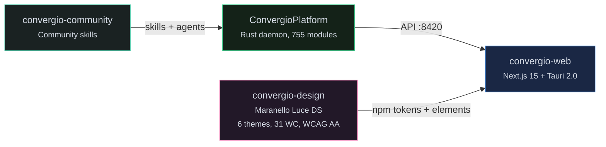
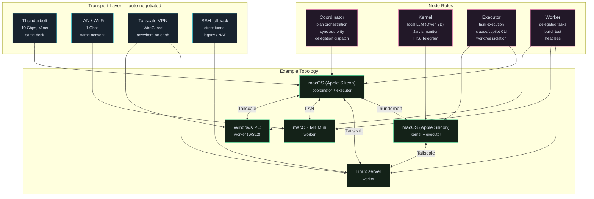
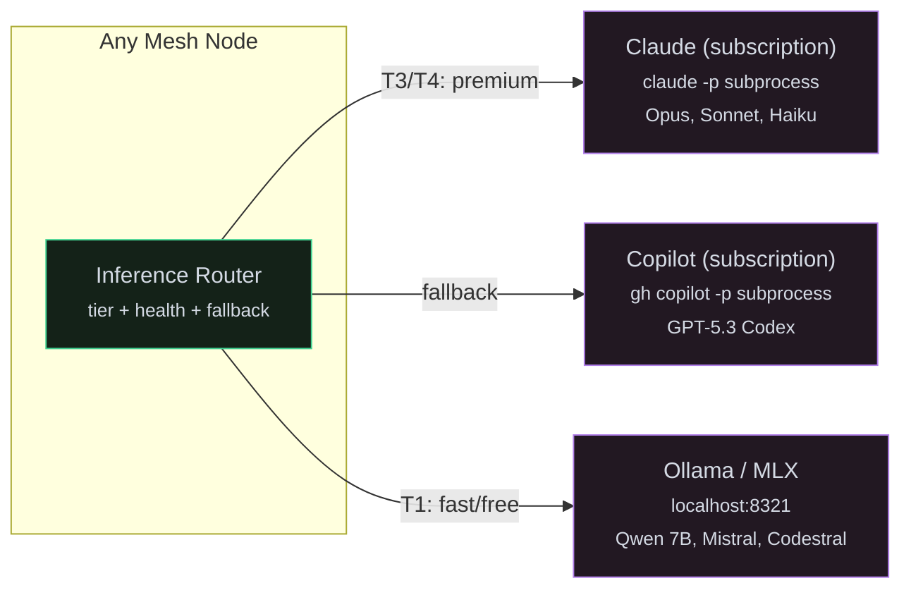

<!-- Copyright (c) 2026 Roberto D'Angelo. Convergio Community License. -->
# Convergio Platform · v20.4.0

Give it a problem. It builds the business. — 69 AI agents across 12 domains (code, strategy, legal, finance, marketing, design, HR, data, security, ops, product, research) orchestrated by a Rust daemon on your own hardware. No cloud lock-in.

**Free and source-available** under the [Convergio Community License](./LICENSE). Use it, learn from it, build with it. If it helps you, consider supporting [FightTheStroke Foundation](https://fightthestroke.org) — a non-profit for children affected by pediatric stroke.

> Not affiliated with or endorsed by Microsoft Corporation.

Website: [convergio.io](https://convergio.io)

---

## What is Convergio

Convergio is a virtual organization. You describe a business problem; Ali (Chief of Staff) assembles the right team — not just developers, but strategists, lawyers, designers, analysts, marketers — coordinates them across models and machines, and delivers validated results.

```bash
convergio solve "Build a SaaS MVP for fitness tracking"
convergio solve "Analyze our competitive landscape and recommend positioning"
convergio solve "Review our contracts for GDPR compliance"
convergio solve "Design a go-to-market strategy for the EU market"
convergio solve "Create a financial model for Series A fundraising"
```

Ali selects from 69 specialized agents across 12 domains:

| Domain | Agents | Example tasks |
|---|---|---|
| **Strategy** | Amy CFO, Antonio OKR, Domik McKinsey, Matteo architect | Financial modeling, competitive analysis, pricing strategy |
| **Legal** | Elena compliance, Sophia govaffairs, Luca security | GDPR review, contract analysis, regulatory strategy |
| **Marketing** | Sofia strategist, Riccardo storyteller, Fabio sales | Go-to-market, brand identity, sales strategy |
| **Design** | Sara UX/UI, Jony creative director, Stefano design thinking | User research, interface design, design systems |
| **Product** | Marcello PM, Davide project mgr, Luke program mgr | Roadmap planning, feature prioritization, OKR tracking |
| **Data** | Omri data scientist, Fiona market analyst, Diana dashboard | Market research, predictive modeling, analytics |
| **People** | Giulia HR, Coach team coach, Behice cultural | Hiring strategy, team dynamics, cross-cultural |
| **Technical** | Baccio architect, Rex reviewer, Dario debugger, Marco DevOps | Architecture, code review, debugging, CI/CD |
| **Startup** | Sam startupper (YC), Wiz VC analyst | Pitch decks, fundraising, product-market fit |
| **Research** | Research report generator, Socrates first principles | Equity research, market analysis, decision frameworks |
| **Compliance** | Dr. Enzo healthcare, Guardian AI security | HIPAA, FDA, AI ethics, bias detection |
| **Quality** | Thor validator, plan-reviewer, doc-validator | 10-gate validation, code/doc/design/strategy review |

Every task gets the right specialist, the right model, and the right validator — automatically.

### Hybrid Intelligence: Cloud + Local

Convergio runs on **your hardware first**. Apple Silicon Macs run local LLMs (Qwen 7B, Mistral, Codestral) via MLX with Metal GPU acceleration — zero cloud dependency for most tasks. For premium reasoning (Opus, GPT-5), it uses your existing Claude/Copilot subscriptions. No API keys, no per-token billing surprises.

| Where | Models | Cost | Best for |
|---|---|---|---|
| **Local (MLX on Apple Silicon)** | Qwen 7B, Mistral 7B, Codestral 22B | $0 | Fast tasks, privacy-sensitive, offline |
| **Local (Ollama on any machine)** | Any GGUF model | $0 | Linux/Windows workers, experimentation |
| **Anthropic Claude (your subscription)** | Opus 4.6, Sonnet 4.6, Haiku 4.5 | Subscription | Complex reasoning, architecture, validation |
| **GitHub Copilot (your subscription)** | GPT-5.3 Codex, GPT-5.1 Codex Mini, GPT-5.4, Claude Sonnet 4.6, Gemini 3 Pro | Subscription | Code generation, deep debugging, large-context research |
| **Any CLI-based LLM** | Gemini (`gemini`), Grok, Mistral, OpenAI (`openai`), or any future model | Varies | Add via config — any LLM with a CLI is a valid provider |

The inference router picks the cheapest provider that meets the task tier — and falls back automatically if one is unavailable.

The architecture is **provider-agnostic**: the daemon spawns CLI subprocesses, so any LLM with a command-line interface can be added as a provider (Gemini, Mistral, Grok, Llama, or any future model). Adding a new provider is a config change, not a code change.

---

## Installation

### macOS (Homebrew)

```bash
brew tap Roberdan/convergio
brew install convergio
```

### Linux / macOS (binary)

```bash
curl -sSL https://github.com/Roberdan/ConvergioPlatform/releases/latest/download/install.sh | sh
```

### From source

```bash
cargo install --git https://github.com/Roberdan/ConvergioPlatform --features kernel
```

### First run

```bash
cvg setup
```

---

## Quick Start

```bash
git clone https://github.com/Roberdan/ConvergioPlatform.git
cd ConvergioPlatform
./setup.sh                         # env vars, CLI aliases, enable overlay
cd daemon && cargo build --release # build Rust daemon (~2 min)
convergio daemon install           # auto-start on boot
convergio solve "your goal"        # Ali assembles a team and solves
```

The `cvg` CLI (short alias) provides direct access to all daemon operations:

```bash
cvg plan list                              # list active plans
cvg plan show 10022                        # plan details + task status
cvg task update 9678 submitted             # mark task submitted
cvg checkpoint save 10022                  # save plan state
cvg agent list                             # list active agents
cvg claude roberto                         # launch claude with auto-registration
cvg copilot worker-1                       # launch copilot with auto-registration  
cvg copilot child-1 --parent roberto       # launch with parentage link
cvg who agents                             # show workers + IPC agent tree
cvg kernel status                          # local LLM health
cvg mesh status                            # peer topology
cvg workspace list                         # list active workspaces
```

---

## Architecture (v20.0.0)

```mermaid
graph TB
    %% ── User Interfaces ──────────────────────────
    subgraph UI["User Interfaces"]
        WEB["convergio-web<br><small>Next.js 15 + Tauri 2.0<br>Maranello Luce DS (6 themes)</small>"]
        TUI["TUI<br><small>ratatui terminal</small>"]
        CLI["CLI (cvg)<br><small>50+ subcommands</small>"]
        VOICE["Voice<br><small>Wake word 'convergio'<br>Whisper STT → Mistral Voxtral TTS</small>"]
        PHONE["Telegram Mobile<br><small>iPhone / Android<br>text + voice control</small>"]
        MCP["MCP Server<br><small>18 tools, ring security</small>"]
    end

    %% ── Daemon Core ──────────────────────────────
    subgraph DAEMON["Daemon Core — Rust — :8420"]
        SERVER["HTTP Server (axum)<br><small>250+ endpoints<br>REST + SSE + WebSocket</small>"]
        ORCH["Orchestrator<br><small>reactor, executor<br>reaper, delegation</small>"]
        INF["Inference Router<br><small>tier T1→T4<br>health probe, fallback chain</small>"]
        IPC["IPC Bus<br><small>named sessions, budget<br>send-direct, channels</small>"]
        KERN["Kernel / Jarvis<br><small>monitor 30s, recover<br>Telegram, Ali escalation</small>"]
        SEC["Security<br><small>JWT RBAC, audit trail<br>agent sandboxing</small>"]
        THOR["Thor Validator<br><small>10-gate checklist<br>queue, durable verdicts</small>"]
        SYNC["Background Sync<br><small>conflict-aware LWW<br>multi-transport</small>"]
        MEM["Memory<br><small>vector store, CRUD<br>GC + tiering</small>"]
        WS["Workspace<br><small>worktree per task<br>quality gate, release agent</small>"]
        NIGHT["Nightly Job<br><small>cleanup, eval, optimize<br>issue scan, token audit</small>"]
        POLICY["Autonomous Policy<br><small>risk classification<br>auto-progress LOW/MED</small>"]
    end

    %% ── Data Layer ───────────────────────────────
    subgraph DATA["Data Layer"]
        DB[("dashboard.db<br><small>SQLite WAL<br>timestamp sync</small>")]
        GIT["Git Repos<br><small>GitHub API<br>worktree isolation</small>"]
        AUDIT[("Audit Log<br><small>append-only<br>immutable trail</small>")]
    end

    %% ── Mesh Network ─────────────────────────────
    subgraph MESH["Mesh Network — Tailscale P2P"]
        M5["Mac Studio<br><small>Coordinator<br>100.x.x.x</small>"]
        M1["MacBook Pro<br><small>Kernel node<br>100.y.y.y</small>"]
        FUTURE["Future nodes<br><small>worker role</small>"]
    end

    %% ── LLM Providers (no external proxy) ────────
    subgraph LLM["LLM Providers — Native Rust"]
        CLISUB["Claude Subscription<br><small>claude -p subprocess<br>SSE stdout capture</small>"]
        COPSUB["Copilot Subscription<br><small>gh copilot -p<br>fallback provider</small>"]
        LOCAL["Local LLM<br><small>Ollama / MLX :8321<br>Qwen 7B (Jarvis)</small>"]
    end

    %% ── Evolution Engine ─────────────────────────
    subgraph EVO["Evolution Engine — TypeScript"]
        ECORE["Core<br><small>evaluators, cadence<br>guardrails, experiments</small>"]
        EADAPT["Adapters<br><small>claude, dashboard<br>maranello, telemetry</small>"]
    end

    %% ── External Ecosystem ──────────────────────
    subgraph ECO["Ecosystem Repos"]
        DS["convergio-design<br><small>Maranello DS, 6 themes<br>31 WC, WCAG 2.2 AA</small>"]
        COMM["convergio-community<br><small>community skills</small>"]
    end

    TG["Telegram Bot API"]
    OCLAW["OpenClaw<br><small>30+ platforms</small>"]

    %% ── Governance ───────────────────────────────
    subgraph GOV["Agent Governance"]
        HOOKS["10 Hard Rules<br><small>SecretScan, SqliteBlock<br>EvidenceGate, Wiring</small>"]
        AGENTS["69 Agents · 12 Domains<br><small>Ali orchestrator<br>10-domain routing</small>"]
    end

    %% ── CONNECTIONS ──────────────────────────────

    %% UI → Daemon
    WEB -- "HTTP + WS + SSE" --> SERVER
    TUI -- "WS /ws/brain" --> SERVER
    CLI -- "HTTP :8420" --> SERVER
    VOICE -- "cpal audio → /api/voice/*" --> KERN
    PHONE -- "Bot API → long poll" --> KERN
    MCP -. "stdio → HTTP" .-> SERVER

    %% Internal daemon
    SERVER --> ORCH
    SERVER --> IPC
    SERVER --> KERN
    ORCH --> THOR
    ORCH --> POLICY
    ORCH --> NIGHT
    KERN --> INF
    SEC --> SERVER
    SYNC --> DB

    %% Daemon → Data
    SERVER --> DB
    SERVER --> AUDIT
    IPC --> DB
    WS --> GIT

    %% Daemon → Mesh (conflict-aware sync)
    M5 -- "sync + delegate" --> M1
    M1 -- "sync + Jarvis" --> M5
    M5 -. "future" .-> FUTURE

    %% Daemon → LLM (subscription, no API keys)
    INF -- "subprocess" --> CLISUB
    INF -- "fallback" --> COPSUB
    INF -- "HTTP :8321" --> LOCAL

    %% Daemon → External
    KERN -- "Bot API" --> TG
    SERVER --> OCLAW

    %% Evolution → Daemon
    EADAPT -- "HTTP /api/*" --> SERVER
    ECORE --> EADAPT

    %% Ecosystem
    WEB -. "npm" .-> DS
    DS -. "tokens + WC" .-> WEB

    %% Governance (cross-cutting)
    GOV -. "enforcement" .-> DAEMON

    %% Styling
    classDef ui fill:#1a2744,stroke:#4d9cf6,color:#d4dae4
    classDef daemon fill:#142218,stroke:#42d392,color:#d4dae4
    classDef data fill:#18232e,stroke:#38c8d8,color:#d4dae4
    classDef mesh fill:#18232e,stroke:#38c8d8,color:#d4dae4
    classDef evo fill:#221828,stroke:#e87ab0,color:#d4dae4
    classDef llm fill:#221822,stroke:#b07ee8,color:#d4dae4
    classDef gov fill:#221818,stroke:#e85454,color:#d4dae4
    classDef ext fill:#1a1a22,stroke:#6b7a8d,color:#d4dae4
    classDef eco fill:#1a2222,stroke:#4dc8a8,color:#d4dae4

    class WEB,TUI,CLI,VOICE,PHONE,MCP ui
    class SERVER,ORCH,INF,IPC,KERN,SEC,THOR,SYNC,MEM,WS,NIGHT,POLICY daemon
    class DB,GIT,AUDIT data
    class M5,M1,FUTURE mesh
    class ECORE,EADAPT evo
    class CLISUB,COPSUB,LOCAL llm
    class HOOKS,AGENTS gov
    class TG,OCLAW ext
    class DS,COMM eco
```



### What's New in v20.0.0

| Area | Change |
|---|---|
| **LLM providers** | `ClaudeSubscription`, `CopilotSubscription`, `LocalLLM` — zero Python deps; `Provider::LiteLLM` removed |
| **Budget tracking** | Per-session and cumulative spend wired into chat pipeline; alerts via Telegram + dashboard WebSocket |
| **Session IPC** | Named sessions, `agents/list`, `agents/deregister`, `agents/send-direct` endpoints |
| **Agent parentage** | `parent_agent` column in `ipc_agents`, `GET /api/ipc/agents/tree` for hierarchical view, brain viz integration |
| **CLI wrappers** | `cvg claude <name>` / `cvg copilot <name>` — auto-register/deregister agents with optional `--parent` linkage |
| **Brain telemetry** | `broadcast_brain_message_event` for inter-agent message flow; `ipc_agents` in `/api/brain` response |
| **Timestamp sync** | Timestamp-based LWW sync with conflict logging; `_sync_conflicts` table for review |
| **Nightly autonomy** | Scheduled tokio job (default 02:00): goal decomposer → risk policy → audit trail |
| **Goal decomposer** | Hierarchical goal-to-task decomposition stored in plan DB |
| **Risk-based policy** | Configurable risk thresholds; LOW auto-progress, HIGH gates for human approval |
| **Agent sandboxing** | Per-agent capability sets with command validation in delegation pipeline; filesystem/network enforcement planned |
| **Rollback snapshots** | Daemon persists pre-apply snapshots for plan/task rollback |
| **Audit trail** | Mutation requests (POST/PUT/DELETE) logged with agent identity in `audit_log` |

### Layer Summary

| Layer | Path | Lang | Purpose |
|---|---|---|---|
| **Daemon** | `daemon/` | Rust | HTTP/WS/SSE API (:8420), mesh P2P, IPC, SQLite WAL, TUI, `cvg` CLI |
| **Kernel** | `daemon/src/kernel/` | Rust | Local LLM (Qwen 7B), health monitor, verify gate, TTS (Mistral Voxtral 4B), Telegram bot |
| **Inference** | `daemon/src/inference/` | Rust | Tier-based routing (T1-T4), fallback chain, health probing |
| **MCP Server** | `daemon/src/mcp_server/` | Rust | 18 tools for any LLM client, ring-based security (0-3) |
| **Workspace** | `daemon/src/workspace/` | Rust | Worktree isolation, git abstraction, Release Agent, quality gates |
| **Evolution** | `evolution/` | TS | Self-improvement: telemetry → proposals → experiments |
| **Scripts** | `scripts/` | Bash | Mesh ops, sync tests, platform tooling |
| **Config** | `claude-config/` | MD | 69 agents, 2 rule files (10 hard + best practices) |

Daemon stack: axum · rusqlite WAL · tokio · ssh2 · ratatui · serde · hmac+sha2+aes-gcm · reqwest · tracing

### Execution Flow

```
/solve (Opus) → /planner (Opus 1M) → Review (Sonnet) → DB → /execute (workers) → Thor (10 gates) → Merge → Done
```

Workers execute in isolated worktrees. Plan runner auto-spawns fresh CLI sessions per task (ADR-0122 recursive session continuity).

### Model Routing

All LLM calls use logged-in subscriptions (Claude Pro, Copilot Pro). No API keys.

| Tier | Models | Used for |
|------|--------|----------|
| T1 (fast/cheap) | Local Qwen 7B, Haiku 4.5 | Exploration, docs, simple tasks |
| T2 (standard) | Sonnet 4.6 | Coordination, review, general tasks |
| T3 (premium) | Opus 4.6 | Architecture, planning, validation |
| T4 (critical) | Opus 4.6 1M | Full-codebase planning, complex reasoning |

Inference Router: tier selection → health probe → fallback chain (Claude → Local → Copilot).

---

## Ecosystem



| Repository | Purpose | Status |
|---|---|---|
| [**convergio-web**](https://github.com/Roberdan/convergio-web) | Web + desktop UI (Next.js 15 + Tauri 2.0 + Maranello DS) | Active |
| [**convergio-design**](https://github.com/Roberdan/convergio-design) | Maranello Luce Design System — 6 themes, 31 components, WCAG 2.2 AA | v6.1.1 |
| [**convergio-community**](https://github.com/Roberdan/convergio-community) | Community-contributed skills and extensions | Active |

---

## Mesh (P2P Multi-Node)

Scalable peer-to-peer mesh. Any Mac, Linux, or Windows machine can join as a node with a single command. Nodes auto-discover via Tailscale and communicate over multiple transports with automatic fallback.



### Node Roles

| Role | Capabilities | Requirements |
|---|---|---|
| **Coordinator** | Plan orchestration, sync authority, delegation dispatch | Daemon + DB |
| **Kernel** | Local LLM, Jarvis monitor, TTS, Telegram, Ali escalation | + Python venv, MLX models, Telegram token |
| **Executor** | Run tasks via Claude/Copilot CLI in worktrees | + claude/copilot CLI logged in |
| **Worker** | Receive delegated tasks, build, test | Daemon only (minimal) |

A node can have multiple roles (e.g., coordinator + executor).

### Transport Negotiation

The daemon probes each peer in priority order and uses the fastest reachable transport:

| Priority | Transport | Bandwidth | Latency | Use case |
|---|---|---|---|---|
| 1 | Thunderbolt 5 (10.0.0.x) | 120 Gbps | <1ms | Same desk, macOS ↔ macOS |
| 2 | LAN / Wi-Fi 6E | 10 Gbps | 1-5ms | Same network |
| 3 | Tailscale VPN (100.x.x.x) | varies | 5-50ms | Anywhere, encrypted WireGuard tunnel |
| 4 | SSH direct | varies | 10-100ms | Legacy, NAT traversal, fallback |

If a transport disappears (e.g., Thunderbolt dock unplugged), the daemon falls back to the next available transport within 5 seconds — no restart needed.

### Multi-Model Execution

Every node can use any combination of LLM providers. The daemon routes tasks to the best available model based on tier, health, and cost — transparently.



No API keys — all cloud calls go through logged-in CLI subscriptions. Local models run on-device with zero cloud dependency.

### Distributed Task Delegation

The coordinator can delegate any plan or individual task to any node in the mesh:

```bash
# Delegate a full plan to a remote node
cvg plan delegate 10022 --node kernel-node

# Delegate a single task to the best available executor
cvg task delegate 9678 --auto       # picks node by health + capacity

# Run tasks in parallel across nodes
cvg plan start 10022 --parallel     # W1 tasks split across available executors
```

The daemon handles: worktree creation on the target node, context transfer via `/api/plan-db/execution-context`, progress reporting back to coordinator via sync, and automatic failover if a node becomes unreachable.

### Sync

- Timestamp-based LWW sync with conflict logging to `_sync_conflicts`
- LWW with coordinator priority; conflict detection across all sync tables
- Conflicted changes → `_sync_conflicts` table for review
- `/api/sync/status` shows per-peer, per-table health

### Deploy a New Node

```bash
# Provision any machine (macOS or Linux) as a mesh node
scripts/mesh/deploy-node.sh <hostname> --role executor

# Or with kernel capabilities (needs Apple Silicon for MLX)
scripts/mesh/deploy-node.sh <hostname> --role kernel

# Verify readiness
ssh <hostname> "cvg node readiness"
```

```bash
cvg mesh status            # peer topology + transport
cvg mesh sync              # force sync all tables
cvg node readiness         # 10-point health check
```

---

## Kernel

The kernel runs Qwen 2.5 7B locally on Apple Silicon, providing:

- **Monitor loop** (30s) — health checks, stall detection, rate limit tracking
- **Verify gate** — blocks task completion without evidence
- **Recovery** — restart crashed daemons, checkpoint state, notify operators
- **TTS** — Mistral Voxtral 4B (primary), Siri fallback
- **Voice pipeline** — cpal audio → VAD (webrtc) → wake word "convergio" → Whisper STT → intent → response
- **Telegram bot** — bidirectional text + voice, long polling, quiet hours (23:00-07:00 CET)
- **Ali escalation** — "ali dimmi..." triggers Claude CLI (Opus) subprocess with full context
- **Jarvis intelligence** — always-on context (plans, agents, costs, health, mesh, history), multi-round tool calling, conversation memory, EscalateToAli (Claude with full platform context for unrecognized or complex messages)

### Mesh Auto-Update

Nodes self-upgrade when peers report newer daemon versions. The coordinator builds once; workers rsync the binary. Runs every 5 minutes with quiet hours (23:00-07:00 CET) and a 30-minute rate limit. Failed updates trigger automatic rollback from `~/.convergio/bin/*.bak`. Check status: `GET /api/mesh/update-status`.

```bash
cvg kernel status          # health report
cvg kernel here            # set active audio node (8h)
cvg kernel say "hello"     # TTS on active node
```

---

## Agents

See [AGENTS.md](AGENTS.md) for the full catalog — 69 agents across 12 domains.

| Domain | Count | Examples |
|---|---|---|
| Core Utility | 15 | Ali orchestrator, Thor validator, planner, reviewer |
| Technical Dev | 8 | task-executor, Rex reviewer, Dario debugger, Baccio architect |
| Business Ops | 8 | Davide PM, Sofia marketing, Fabio sales, Andrea CS |
| Leadership | 6 | Amy CFO, Antonio strategy, Domik McKinsey, Sam startup |
| Specialized | 10 | Omri data scientist, Fiona analyst, coach, Jenny a11y |
| Compliance | 5 | Elena legal, Luca security, Sophia govaffairs |
| Design | 3 | Sara UX/UI, Jony creative, Stefano design thinking |
| Release | 3 | app-release-manager, feature-release, ecosystem-sync |

All agents support: Claude Code, Copilot CLI, and local LLMs. Ali orchestrator routes goals to the right team using 10-domain routing (market, legal, finance, architecture, UX, people, product, startup, data, quality).

---

## Installation

### Prerequisites

- Rust stable toolchain (`rustup`)
- Node.js 20+ (for evolution engine)
- Tailscale (for mesh networking)
- macOS or Linux (Apple Silicon recommended for kernel)

### Build

```bash
cd daemon && cargo build --release   # build daemon (~2 min)
cd daemon && cargo test              # 2200+ tests
cd evolution && npx vitest run       # evolution tests
```

### Deploy to mesh node

```bash
scripts/mesh/deploy-node.sh <node-hostname> --kernel   # full provision
scripts/kernel/sync-db.sh <node-hostname>              # sync database
```

### Node readiness

```bash
cvg node readiness    # 10-point health check
```

Checks: DB integrity, disk space, models downloaded, Telegram token, daemon version, role capabilities.

---

## Governance

| Document | Purpose |
|---|---|
| [CONSTITUTION.md](CONSTITUTION.md) | 12 articles, 5 NON-NEGOTIABLE (identity, quality, verification, resilience, swarm) |
| [AgenticManifesto.md](AgenticManifesto.md) | Design philosophy — "Human purpose. AI momentum." |
| [claude-config/rules/hard-enforcement.md](claude-config/rules/hard-enforcement.md) | 10 hook-enforced rules |
| [claude-config/rules/best-practices.md](claude-config/rules/best-practices.md) | Suggested coding standards |

---

## Competitive Comparison

How Convergio compares to similar open-source projects:

- [**claw-code**](https://github.com/instructkr/claw-code) — Clean-room Python+Rust rewrite of Claude Code CLI; single-agent tool harness.
- [**oh-my-codex**](https://github.com/Yeachan-Heo/oh-my-codex) — Workflow layer on OpenAI Codex CLI; adds role keywords and tmux team mode.
- [**openclaw**](https://github.com/openclaw/openclaw) — Self-hosted Node.js AI assistant gateway with 25+ messaging channels and voice.

| Aspect | claw-code | oh-my-codex | openclaw | Convergio |
|---|---|---|---|---|
| Focus | CLI replication | CLI workflow layer | Personal assistant | AI orchestration platform |
| Architecture | CLI | CLI wrapper | Local gateway | Rust daemon + mesh |
| Language | Python + Rust | TypeScript | TypeScript | Rust |
| Agent system | Single agent | Role keywords (`$architect`, `$executor`) | Multi-agent routing | 50+ typed agents |
| Channels | Terminal | Terminal + tmux | 25+ messaging | Telegram + Siri |
| Model support | Anthropic only | OpenAI only | Multi-provider + failover | Multi-provider + local Qwen 7B |
| Planning | None | `$plan` skill | None | Plan + wave + task + Thor QA |
| Distribution | Local | Local + tmux | Local gateway | Tailscale mesh (3 nodes) |
| Voice | None | None | Wake word + talk mode | Siri + kernel STT/TTS |
| Governance | None | None | None | Constitution + Thor 10-gate QA |
| UI | None | Terminal | Web canvas + A2UI | Dashboard + A2UI SSE |
| License | MIT | MIT | MIT | Proprietary |

---

## Contributing

See [CONTRIBUTING.md](CONTRIBUTING.md) for contribution guidelines, code standards, and the plan-driven development workflow.

---

## Legal

See [LEGAL_NOTICE.md](LEGAL_NOTICE.md) for full legal terms.

Convergio Platform is not affiliated with or endorsed by Microsoft Corporation or any other third party. All trademarks belong to their respective owners.

---

## License

> **Convergio is free. The code is open. We trust you.**

This project is released under the [**Convergio Community License**](./LICENSE) — a source-available license. The source code is public and readable, but commercial redistribution and hosted services require explicit permission.

### What you can do

- **Use** Convergio for any personal, educational, or commercial purpose
- **Read, study, and learn** from the source code
- **Modify** the code for your own use
- **Fork and redistribute** — as long as the license stays attached

### What you cannot do

- **Sell** Convergio as a product or substantial part of one
- **Host** it as a managed/SaaS offering for third parties
- **Remove** the license or copyright notice

Want to do any of the above? We're happy to talk: **licensing@convergio.io**

### Always free, no questions asked

| Who | Conditions |
|---|---|
| Students | None. No registration, no proof. |
| People with disabilities | None. No paperwork. |
| Non-profit organizations | None. We trust you. |

### FightTheStroke Foundation

Convergio was created by Roberto D'Angelo, co-founder of [FightTheStroke Foundation](https://fightthestroke.org) — a non-profit born after his son Mario experienced a stroke at birth. The foundation supports children with cerebral palsy and their families through innovative rehabilitation, advocacy, and inclusion programs.

If Convergio brings value to your work, we ask one thing: **help someone who needs it.** Consider a donation to FightTheStroke. This is not a legal obligation — it's an invitation.

### Professional services

Want help getting the most out of Convergio? We offer consulting, workshops, and speaking engagements — priced on the value we create together, not by the hour. Reach out at [convergio.io](https://convergio.io).

---

*Built for solopreneurs who dare to build alone.*
*If it helps you grow, help someone grow too.*

---

Copyright (c) 2026 Roberto D'Angelo
