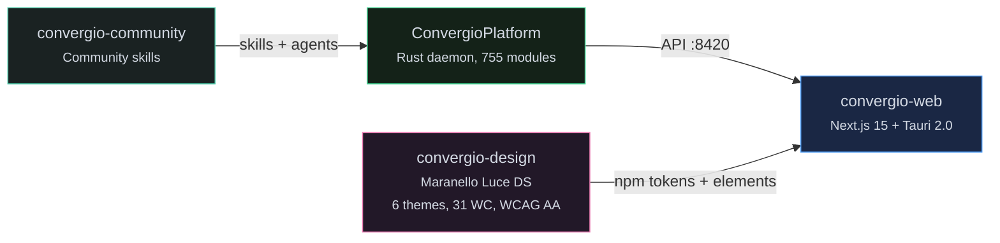
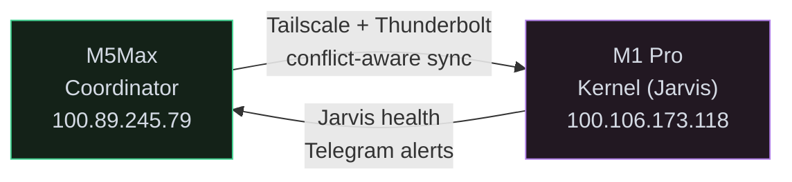

<!-- Copyright (c) 2026 Roberto D'Angelo. Convergio Community License. -->
# Convergio Platform

AI orchestration platform — Rust daemon (755 modules), local LLM kernel (Qwen 7B), MCP server, mesh P2P, 69 agents, Telegram bot, voice pipeline.

**Free and source-available** under the [Convergio Community License](./LICENSE). Use it, learn from it, build with it. If it helps you, consider supporting [FightTheStroke Foundation](https://fightthestroke.org) — a non-profit for children affected by pediatric stroke.

> Not affiliated with or endorsed by Microsoft Corporation.

Website: [convergio.io](https://convergio.io)

---

## What is Convergio

Convergio Platform is a self-improving AI orchestration system. You describe a goal; Ali (Chief of Staff, Opus) assembles a team of specialized agents, coordinates them across models and machines, validates output through domain-specific validators, and delivers structured results with cost, duration, and learnings.

```bash
convergio solve "Build a SaaS MVP for fitness tracking"
```

Ali handles everything: domain analysis, talent selection (69 agents across 12 domains), plan creation, agent dispatch, real-time monitoring, validation, and knowledge capture.

---

## Quick Start

```bash
git clone https://github.com/Roberdan/ConvergioPlatform.git
cd ConvergioPlatform
./setup.sh                         # env vars, CLI aliases, enable overlay
cd daemon && cargo build --release # build Rust daemon (~2 min)
convergio daemon install           # auto-start on boot
convergio solve "your goal"        # Ali assembles a team and solves
```

The `cvg` CLI (short alias) provides direct access to all daemon operations:

```bash
cvg plan list                              # list active plans
cvg plan show 10022                        # plan details + task status
cvg task update 9678 submitted             # mark task submitted
cvg checkpoint save 10022                  # save plan state
cvg agent list                             # list active agents
cvg kernel status                          # local LLM health
cvg mesh status                            # peer topology
cvg workspace list                         # list active workspaces
```

---

## Architecture (v20 target)

```mermaid
graph TB
    %% ── User Interfaces ──────────────────────────
    subgraph UI["User Interfaces"]
        WEB["convergio-web<br><small>Next.js 15 + Tauri 2.0<br>Maranello Luce DS (6 themes)</small>"]
        TUI["TUI<br><small>ratatui terminal</small>"]
        CLI["CLI (cvg)<br><small>50+ subcommands</small>"]
        VOICE["Voice / Siri<br><small>Wake word → Whisper → TTS</small>"]
        MCP["MCP Server<br><small>18 tools, ring security</small>"]
    end

    %% ── Daemon Core ──────────────────────────────
    subgraph DAEMON["Daemon Core — Rust — :8420"]
        SERVER["HTTP Server (axum)<br><small>250+ endpoints<br>REST + SSE + WebSocket</small>"]
        ORCH["Orchestrator<br><small>reactor, executor<br>reaper, delegation</small>"]
        INF["Inference Router<br><small>tier T1→T4<br>health probe, fallback chain</small>"]
        IPC["IPC Bus<br><small>named sessions, budget<br>send-direct, channels</small>"]
        KERN["Kernel / Jarvis<br><small>monitor 30s, recover<br>Telegram, Ali escalation</small>"]
        SEC["Security<br><small>JWT RBAC, audit trail<br>agent sandboxing</small>"]
        THOR["Thor Validator<br><small>10-gate checklist<br>queue, durable verdicts</small>"]
        SYNC["Background Sync<br><small>conflict-aware LWW<br>multi-transport</small>"]
        MEM["Memory<br><small>vector store, CRUD<br>GC + tiering</small>"]
        WS["Workspace<br><small>worktree per task<br>quality gate, release agent</small>"]
        NIGHT["Nightly Job<br><small>cleanup, eval, optimize<br>issue scan, token audit</small>"]
        POLICY["Autonomous Policy<br><small>risk classification<br>auto-progress LOW/MED</small>"]
    end

    %% ── Data Layer ───────────────────────────────
    subgraph DATA["Data Layer"]
        DB[("dashboard.db<br><small>SQLite WAL<br>timestamp sync</small>")]
        GIT["Git Repos<br><small>GitHub API<br>worktree isolation</small>"]
        AUDIT[("Audit Log<br><small>append-only<br>immutable trail</small>")]
    end

    %% ── Mesh Network ─────────────────────────────
    subgraph MESH["Mesh Network — Tailscale P2P"]
        M5["M5Max<br><small>Coordinator<br>100.89.245.79</small>"]
        M1["M1 Pro<br><small>Kernel node<br>100.106.173.118</small>"]
        FUTURE["Future nodes<br><small>worker role</small>"]
    end

    %% ── LLM Providers (no external proxy) ────────
    subgraph LLM["LLM Providers — Native Rust"]
        CLISUB["Claude Subscription<br><small>claude -p subprocess<br>SSE stdout capture</small>"]
        COPSUB["Copilot Subscription<br><small>gh copilot -p<br>fallback provider</small>"]
        LOCAL["Local LLM<br><small>Ollama / MLX :8321<br>Qwen 7B (Jarvis)</small>"]
    end

    %% ── Evolution Engine ─────────────────────────
    subgraph EVO["Evolution Engine — TypeScript"]
        ECORE["Core<br><small>evaluators, cadence<br>guardrails, experiments</small>"]
        EADAPT["Adapters<br><small>claude, dashboard<br>maranello, telemetry</small>"]
    end

    %% ── External Ecosystem ──────────────────────
    subgraph ECO["Ecosystem Repos"]
        DS["convergio-design<br><small>Maranello DS, 6 themes<br>31 WC, WCAG 2.2 AA</small>"]
        COMM["convergio-community<br><small>community skills</small>"]
    end

    TG["Telegram Bot API"]
    OCLAW["OpenClaw<br><small>30+ platforms</small>"]

    %% ── Governance ───────────────────────────────
    subgraph GOV["Agent Governance"]
        HOOKS["10 Hard Rules<br><small>SecretScan, SqliteBlock<br>EvidenceGate, Wiring</small>"]
        AGENTS["69 Agents · 12 Domains<br><small>Ali orchestrator<br>10-domain routing</small>"]
    end

    %% ── CONNECTIONS ──────────────────────────────

    %% UI → Daemon
    WEB -- "HTTP + WS + SSE" --> SERVER
    TUI -- "WS /ws/brain" --> SERVER
    CLI -- "HTTP :8420" --> SERVER
    VOICE -- "/api/voice/*" --> KERN
    MCP -. "stdio → HTTP" .-> SERVER

    %% Internal daemon
    SERVER --> ORCH
    SERVER --> IPC
    SERVER --> KERN
    ORCH --> THOR
    ORCH --> POLICY
    ORCH --> NIGHT
    KERN --> INF
    SEC --> SERVER
    SYNC --> DB

    %% Daemon → Data
    SERVER --> DB
    SERVER --> AUDIT
    IPC --> DB
    WS --> GIT

    %% Daemon → Mesh (conflict-aware sync)
    M5 -- "sync + delegate" --> M1
    M1 -- "sync + Jarvis" --> M5
    M5 -. "future" .-> FUTURE

    %% Daemon → LLM (subscription, no API keys)
    INF -- "subprocess" --> CLISUB
    INF -- "fallback" --> COPSUB
    INF -- "HTTP :8321" --> LOCAL

    %% Daemon → External
    KERN -- "Bot API" --> TG
    SERVER --> OCLAW

    %% Evolution → Daemon
    EADAPT -- "HTTP /api/*" --> SERVER
    ECORE --> EADAPT

    %% Ecosystem
    WEB -. "npm" .-> DS
    DS -. "tokens + WC" .-> WEB

    %% Governance (cross-cutting)
    GOV -. "enforcement" .-> DAEMON

    %% Styling
    classDef ui fill:#1a2744,stroke:#4d9cf6,color:#d4dae4
    classDef daemon fill:#142218,stroke:#42d392,color:#d4dae4
    classDef data fill:#18232e,stroke:#38c8d8,color:#d4dae4
    classDef mesh fill:#18232e,stroke:#38c8d8,color:#d4dae4
    classDef evo fill:#221828,stroke:#e87ab0,color:#d4dae4
    classDef llm fill:#221822,stroke:#b07ee8,color:#d4dae4
    classDef gov fill:#221818,stroke:#e85454,color:#d4dae4
    classDef ext fill:#1a1a22,stroke:#6b7a8d,color:#d4dae4
    classDef eco fill:#1a2222,stroke:#4dc8a8,color:#d4dae4

    class WEB,TUI,CLI,VOICE,MCP ui
    class SERVER,ORCH,INF,IPC,KERN,SEC,THOR,SYNC,MEM,WS,NIGHT,POLICY daemon
    class DB,GIT,AUDIT data
    class M5,M1,FUTURE mesh
    class ECORE,EADAPT evo
    class CLISUB,COPSUB,LOCAL llm
    class HOOKS,AGENTS gov
    class TG,OCLAW ext
    class DS,COMM eco
```



### Current vs In Progress (Plan 10022)

| Area | v19.5.0 (current) | v20.0.0 (Plan 10022, in progress) |
|---|---|---|
| **LLM routing** | Hardcoded to LiteLLM :4000 (Python, blocked by antivirus) | Native Rust: CLI subscription + local LLM, tier-based routing |
| **Inference** | router/fallback/health exist but test-only | Fully wired in production chat pipeline |
| **Budget** | ipc/budget.rs exists, not wired to chat | Wired with alert Telegram + dashboard WebSocket |
| **DB sync** | Timestamp LWW, no conflict detection | Conflict-aware with _sync_conflicts table |
| **Security** | JWT on all routes, skip-permissions in delegation | Skip-permissions removed, audit trail, agent sandboxing |
| **Worker** | Sequential only, no worktree support | Parallel via --plan + ?task_id= API + worktrees |
| **Sessions** | No inter-session communication | Named sessions + IPC send-direct |
| **Validation** | Inline in API handler | Thor as durable service with queue + verdicts |
| **Autonomy** | All tasks need human approval | Risk-based policy: LOW auto-progress, HIGH gated |
| **Nightly** | Manual maintenance | Auto cleanup + eval + optimize (launchd M1 Pro) |
| **Dead code** | 6 unwired modules, 2 orphaned endpoints | All wired or deleted |

### Layer Summary

| Layer | Path | Lang | Purpose |
|---|---|---|---|
| **Daemon** | `daemon/` | Rust | HTTP/WS/SSE API (:8420), mesh P2P, IPC, SQLite WAL, TUI, `cvg` CLI |
| **Kernel** | `daemon/src/kernel/` | Rust | Local LLM (Qwen 7B), health monitor, verify gate, TTS (Voxtral 4B), Telegram bot |
| **Inference** | `daemon/src/inference/` | Rust | Tier-based routing (T1-T4), fallback chain, health probing |
| **MCP Server** | `daemon/src/mcp_server/` | Rust | 18 tools for any LLM client, ring-based security (0-3) |
| **Workspace** | `daemon/src/workspace/` | Rust | Worktree isolation, git abstraction, Release Agent, quality gates |
| **Evolution** | `evolution/` | TS | Self-improvement: telemetry → proposals → experiments |
| **Scripts** | `scripts/` | Bash | Mesh ops, sync tests, platform tooling |
| **Config** | `claude-config/` | MD | 69 agents, 2 rule files (10 hard + best practices) |

Daemon stack: axum · rusqlite WAL · tokio · ssh2 · ratatui · serde · hmac+sha2+aes-gcm · reqwest · tracing

### Execution Flow

```
/solve (Opus) → /planner (Opus 1M) → Review (Sonnet) → DB → /execute (workers) → Thor (10 gates) → Merge → Done
```

Workers execute in isolated worktrees. Plan runner auto-spawns fresh CLI sessions per task (ADR-0122 recursive session continuity).

### Model Routing

All LLM calls use logged-in subscriptions (Claude Pro, Copilot Pro). No API keys.

| Tier | Models | Used for |
|------|--------|----------|
| T1 (fast/cheap) | Local Qwen 7B, Haiku 4.5 | Exploration, docs, simple tasks |
| T2 (standard) | Sonnet 4.6 | Coordination, review, general tasks |
| T3 (premium) | Opus 4.6 | Architecture, planning, validation |
| T4 (critical) | Opus 4.6 1M | Full-codebase planning, complex reasoning |

Inference Router: tier selection → health probe → fallback chain (Claude → Local → Copilot).

---

## Ecosystem



| Repository | Purpose | Status |
|---|---|---|
| [**convergio-web**](https://github.com/Roberdan/convergio-web) | Web + desktop UI (Next.js 15 + Tauri 2.0 + Maranello DS) | Active |
| [**convergio-design**](https://github.com/Roberdan/convergio-design) | Maranello Luce Design System — 6 themes, 31 components, WCAG 2.2 AA | v6.1.1 |
| [**convergio-community**](https://github.com/Roberdan/convergio-community) | Community-contributed skills and extensions | Active |

---

## Mesh (P2P Multi-Node)

Tailscale-based peer-to-peer networking with HMAC-SHA256 authentication.



| Feature | Detail |
|---|---|
| **Transport** | Tailscale (primary), Thunderbolt (LAN), SSH fallback |
| **Sync** | Timestamp-based LWW with conflict detection (v20) |
| **Deploy** | `scripts/mesh/deploy-node.sh <node> --kernel` |
| **Health** | 30s monitor loop, stall detection, auto-recovery |
| **Readiness** | `/api/node/readiness` — 10 checks at boot |

```bash
cvg mesh status            # peer topology
cvg mesh sync              # force sync
```

---

## Kernel

The kernel runs Qwen 2.5 7B locally on Apple Silicon (M1 Pro), providing:

- **Monitor loop** (30s) — health checks, stall detection, rate limit tracking
- **Verify gate** — blocks task completion without evidence
- **Recovery** — restart crashed daemons, checkpoint state, notify operators
- **TTS** — Voxtral 4B (primary), Siri fallback
- **Voice pipeline** — cpal audio → VAD (webrtc) → wake word "convergio" → Whisper STT → intent → response
- **Telegram bot** — bidirectional text + voice, long polling, quiet hours (23:00-07:00 CET)
- **Ali escalation** — "ali dimmi..." triggers Claude CLI (Opus) subprocess with full context

```bash
cvg kernel status          # health report
cvg kernel here            # set active audio node (8h)
cvg kernel say "hello"     # TTS on active node
```

---

## Agents

See [AGENTS.md](AGENTS.md) for the full catalog — 69 agents across 12 domains.

| Domain | Count | Examples |
|---|---|---|
| Core Utility | 15 | Ali orchestrator, Thor validator, planner, reviewer |
| Technical Dev | 8 | task-executor, Rex reviewer, Dario debugger, Baccio architect |
| Business Ops | 8 | Davide PM, Sofia marketing, Fabio sales, Andrea CS |
| Leadership | 6 | Amy CFO, Antonio strategy, Domik McKinsey, Sam startup |
| Specialized | 10 | Omri data scientist, Fiona analyst, coach, Jenny a11y |
| Compliance | 5 | Elena legal, Luca security, Sophia govaffairs |
| Design | 3 | Sara UX/UI, Jony creative, Stefano design thinking |
| Release | 3 | app-release-manager, feature-release, ecosystem-sync |

All agents support: Claude Code, Copilot CLI, and local LLMs. Ali orchestrator routes goals to the right team using 10-domain routing (market, legal, finance, architecture, UX, people, product, startup, data, quality).

---

## Installation

### Prerequisites

- Rust stable toolchain (`rustup`)
- Node.js 20+ (for evolution engine)
- Tailscale (for mesh networking)
- macOS or Linux (Apple Silicon recommended for kernel)

### Build

```bash
cd daemon && cargo build --release   # build daemon (~2 min)
cd daemon && cargo test              # 2200+ tests
cd evolution && npx vitest run       # evolution tests
```

### Deploy to mesh node

```bash
scripts/mesh/deploy-node.sh roberdandev-m1Pro --kernel   # full provision
scripts/kernel/sync-db.sh roberdandev-m1Pro              # sync database
```

### Node readiness

```bash
cvg node readiness    # 10-point health check
```

Checks: DB integrity, disk space, models downloaded, Telegram token, daemon version, role capabilities.

---

## Governance

| Document | Purpose |
|---|---|
| [CONSTITUTION.md](CONSTITUTION.md) | 12 articles, 5 NON-NEGOTIABLE (identity, quality, verification, resilience, swarm) |
| [AgenticManifesto.md](AgenticManifesto.md) | Design philosophy — "Human purpose. AI momentum." |
| [claude-config/rules/hard-enforcement.md](claude-config/rules/hard-enforcement.md) | 10 hook-enforced rules |
| [claude-config/rules/best-practices.md](claude-config/rules/best-practices.md) | Suggested coding standards |

---

## Contributing

See [CONTRIBUTING.md](CONTRIBUTING.md) for contribution guidelines, code standards, and the plan-driven development workflow.

---

## Legal

See [LEGAL_NOTICE.md](LEGAL_NOTICE.md) for full legal terms.

Convergio Platform is not affiliated with or endorsed by Microsoft Corporation or any other third party. All trademarks belong to their respective owners.

---

## License

> **Convergio is free. The code is open. We trust you.**

This project is released under the [**Convergio Community License**](./LICENSE) — a source-available license. The source code is public and readable, but commercial redistribution and hosted services require explicit permission.

### What you can do

- **Use** Convergio for any personal, educational, or commercial purpose
- **Read, study, and learn** from the source code
- **Modify** the code for your own use
- **Fork and redistribute** — as long as the license stays attached

### What you cannot do

- **Sell** Convergio as a product or substantial part of one
- **Host** it as a managed/SaaS offering for third parties
- **Remove** the license or copyright notice

Want to do any of the above? We're happy to talk: **licensing@convergio.io**

### Always free, no questions asked

| Who | Conditions |
|---|---|
| Students | None. No registration, no proof. |
| People with disabilities | None. No paperwork. |
| Non-profit organizations | None. We trust you. |

### FightTheStroke Foundation

Convergio was created by Roberto D'Angelo, co-founder of [FightTheStroke Foundation](https://fightthestroke.org) — a non-profit born after his son Mario experienced a stroke at birth. The foundation supports children with cerebral palsy and their families through innovative rehabilitation, advocacy, and inclusion programs.

If Convergio brings value to your work, we ask one thing: **help someone who needs it.** Consider a donation to FightTheStroke. This is not a legal obligation — it's an invitation.

### Professional services

Want help getting the most out of Convergio? We offer consulting, workshops, and speaking engagements — priced on the value we create together, not by the hour. Reach out at [convergio.io](https://convergio.io).

---

*Built for solopreneurs who dare to build alone.*
*If it helps you grow, help someone grow too.*

---

Copyright (c) 2026 Roberto D'Angelo
